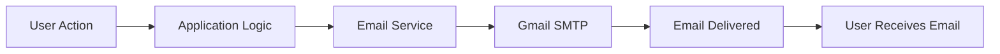

# 📧 Email Confirmation Demo – ASP.NET Core (.NET 8)

[](https://dotnet.microsoft.com/)
[](https://learn.microsoft.com/dotnet/csharp/)
[](LICENSE)

---

## 🎯 Overview

This repository contains a **production-ready, enterprise-grade ASP.NET Core application** that demonstrates **Email Sending and Email Confirmation** using **Gmail SMTP with secure App Password authentication**.

The project is designed to help **students, freshers, junior developers, and working professionals** understand how **email confirmation workflows** are implemented in **real-world enterprise applications**, following **industry best practices** and **MNC-level coding standards**.

---

## 🏢 About This Repository

This repository serves as a **learning-focused yet production-aligned template** for implementing **secure and scalable email functionality** in ASP.NET Core applications.

### 🎓 Target Audience

- 🎓 **Students** learning ASP.NET Core and backend development
- 👨‍💻 **Freshers** building strong portfolios and preparing for interviews
- 🧑‍💼 **Junior Developers** understanding enterprise workflows
- 🏢 **Professionals** seeking clean and reusable email implementation patterns

### 🌟 Why This Project Is Important

Email confirmation is a **critical security feature** in modern applications and is commonly used for:

- User registration and account activation
- Email verification workflows
- Password reset functionality
- Two-factor authentication (2FA)
- Transaction and system notifications

This project demonstrates **how MNCs implement secure email services** using **clean architecture and best practices**.

---

## ✨ Key Features

✅ Secure **Gmail SMTP integration** using App Password  
✅ **Service-based architecture** following SOLID principles  
✅ Built-in **Dependency Injection**  
✅ Clean and maintainable project structure  
✅ Secure configuration using appsettings.json  
✅ Beginner-friendly yet **production-ready**  
✅ Built with **.NET 8 (Latest LTS)**  
✅ Scalable and extensible design  

---

## 🛠️ Language & Technology Used (With Versions)

| Technology | Version | Description |
|------------|---------|-------------|
| ⚙️ **ASP.NET Core** | .NET 8.0 LTS | High-performance web framework |
| 🧠 **C#** | 12.0 | Modern, type-safe programming language |
| 🌐 **.NET SDK** | 8.0 | Runtime and development platform |
| 📬 **SMTP** | Gmail SMTP | Secure email delivery |
| 🏗️ **Dependency Injection** | Built-in | Clean architecture & loose coupling |
| 🔐 **Configuration** | appsettings.json | Secure settings management |

---

## 📂 Project Structure

```plaintext
EmailDemo.BasicConfirmation/
│
├── 📁 Services/
│   ├── 📁 Interfaces/
│   │   └── 📄 IEmailService.cs          # Email service contract
│   └── 📄 EmailService.cs                # Email service implementation
│
├── 📄 Program.cs                          # Application entry point & DI configuration
├── 📄 appsettings.json                    # Application configuration (without secrets)
├── 📄 appsettings.Development.json        # Development environment settings
├── 📄 EmailDemo.BasicConfirmation.csproj  # Project file
├── 📄 EmailDemo.BasicConfirmation.sln     # Solution file
├── 📄 README.md                           # Project documentation
└── 📄 .gitignore                          # Git ignore rules
```

---

## 🔄 Email Confirmation Workflow



### 🏢 Real-World Use Cases

* ✉️ User registration verification
* 🔑 Password reset emails
* 🔐 Two-factor authentication (OTP)
* 📢 System notifications and alerts

---

## 🚀 Getting Started

### ✅ Prerequisites

Before running this project, ensure you have:

* ✔️ **Visual Studio 2022** (version 17.8 or later) or **Visual Studio Code**
* ✔️ **.NET 8 SDK** installed ([Download here](https://dotnet.microsoft.com/download/dotnet/8.0))
* ✔️ **Gmail Account** with 2-Step Verification enabled
* ✔️ **Gmail App Password** generated (see setup guide below)
* ✔️ Basic understanding of C# and ASP.NET Core

### 📥 Installation Steps

#### 1️⃣ Clone or Download the Repository

**Option A: Using Git**

```bash
git clone https://github.com/yourusername/EmailDemo.BasicConfirmation.git
cd EmailDemo.BasicConfirmation
```

**Option B: Download ZIP**

* Download the repository as a ZIP file
* Extract to your desired location

#### 2️⃣ Open the Project

* Launch **Visual Studio 2022**
* Open `EmailDemo.BasicConfirmation.sln`
* Wait for NuGet packages to restore automatically

#### 3️⃣ Configure Email Settings

Open `appsettings.json` and update the email configuration:

```json
{
  "EmailSettings": {
    "FromEmail": "your-email@gmail.com",
    "FromName": "Your Application Name",
    "AppPassword": "your-16-digit-app-password",
    "Host": "smtp.gmail.com",
    "Port": 587,
    "EnableSsl": true
  }
}
```

> ⚠️ **Security Note**: Never commit your actual App Password to version control. Use environment variables or Azure Key Vault in production.

#### 4️⃣ Build the Project

```bash
dotnet build
```

#### 5️⃣ Run the Application

**Using Visual Studio:**

* Press `F5` (with debugging) or `Ctrl+F5` (without debugging)

**Using Command Line:**

```bash
dotnet run
```

#### 6️⃣ Test Email Functionality

* Navigate to the application endpoint
* Trigger email sending functionality
* Check recipient inbox for confirmation email

---

## 🔐 Gmail App Password Setup Guide

To use Gmail SMTP securely, you need to enable 2-Step Verification and generate an App Password.

### Prerequisites

* Valid Gmail account
* Access to account security settings

### 📺 Video Tutorial

**Watch our comprehensive step-by-step video guide:**

[](YOUR_YOUTUBE_VIDEO_LINK_HERE)

📺 **[Click here for detailed video instructions](YOUR_YOUTUBE_VIDEO_LINK_HERE)**

---

## 📸 Project Screenshots

### Application Interface


*Main application interface showing email configuration*

### Email Confirmation Result


*Successful email delivery confirmation*

---

## 🧪 Testing the Application

### Manual Testing Checklist

* [ ] Valid email address sends successfully
* [ ] Invalid email address returns appropriate error
* [ ] Email content displays correctly in recipient inbox
* [ ] SMTP errors are handled gracefully
* [ ] Configuration values are loaded correctly
* [ ] App Password authentication works

---

## 📚 Learning Resources

### Recommended Reading

* [ASP.NET Core Documentation](https://docs.microsoft.com/en-us/aspnet/core/)
* [Dependency Injection in .NET](https://docs.microsoft.com/en-us/dotnet/core/extensions/dependency-injection)
* [SMTP Protocol Overview](https://www.rfc-editor.org/rfc/rfc5321)
* [Gmail SMTP Settings](https://support.google.com/mail/answer/7126229)

---

## 👨‍💻 Author Information

### 👤 **Abhay Yadav**

* 📧 **Email**: abhayyadav19110@gmail.com
* 🔗 **LinkedIn**: [linkedin.com/in/abhay-yadav-58b552366](https://linkedin.com/in/abhay-yadav-58b552366)
* 📺 **YouTube**: [YouTube Channel](https://www.youtube.com/channel/UCVbb9_qIFXSqExcJ31OfMJQ)

---

## 📄 License

This project is licensed under the **MIT License** - see the [LICENSE](LICENSE) file for details.

### MIT License Summary

✅ Commercial use  
✅ Modification  
✅ Distribution  
✅ Private use  

---

## ⭐ Show Your Support

If this project helped you learn or build something, please consider:

* ⭐ **Starring** the repository
* 🔀 **Forking** for your own projects
* 📢 **Sharing** with other developers
* 💬 **Providing feedback** through issues
* 📺 **Subscribing** to my YouTube channel for more tutorials

---

## 📊 Project Statistics


---

<div align="center">

### 💡 Remember: "Learning by doing is the best way to master any technology!"

**Made with ❤️ for the developer community**

</div>

---

<div align="center">

**[⬆ Back to Top](#-email-confirmation-demo--aspnet-core-net-8)**

</div>
